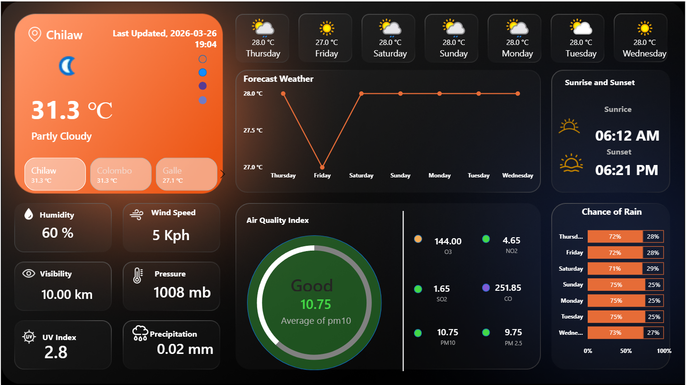
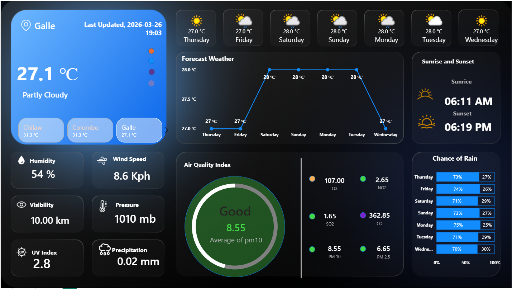
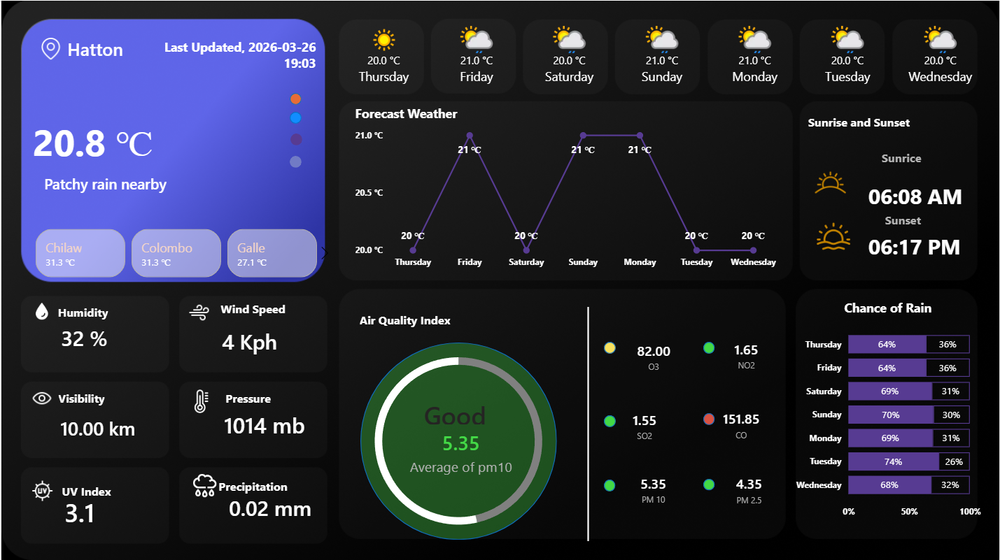

# 🌤️ Intelligent Weather & Air Quality Analytics Dashboard

<div align="center">


**A real-time interactive weather monitoring and air quality analytics dashboard built with Microsoft Power BI — powered by live REST API data.**

</div>

---

## 📸 Dashboard Preview

<div align="center">
  
  <p><em>Live Weather & Air Quality Dashboard — Orange Theme </em></p>
</div>

<div align="center">
  
  <p><em>Live Weather & Air Quality Dashboard — Blue Theme</em></p>
</div>

<div align="center">
  
  <p><em>Live Weather & Air Quality Dashboard — Purple Theme</em></p>
</div>
---

## 📌 Project Overview

This is an end-to-end **Data Analytics Dashboard** built with **Power BI**, designed to provide:
- Real-time weather monitoring across multiple Sri Lankan cities
- 7-day predictive weather forecasting
- Comprehensive Air Quality Index (AQI) analysis with health classifications
- Astronomical data (Sunrise & Sunset times)

Unlike static dashboards, this solution fetches **live data from a REST API**, cleans and transforms JSON responses using **Power Query (M Language)**, and uses complex **DAX measures** to build dynamic, color-coded environmental indices.

> ⚠️ **Note:** The WeatherAPI free tier provides limited daily API calls. You will need your own free API key to refresh live data.

---

## 🚀 Key Features

- **Real-Time API Integration** — Live JSON data extraction from WeatherAPI.com directly into Power BI
- **Multi-City Comparison** — Galle, Colombo, Chilaw side-by-side weather tracking
- **Advanced AQI Monitoring** — PM2.5, PM10, CO, NO2, SO2, O3 with WHO health classifications
- **7-Day Predictive Forecast** — Temperature trend lines and rain probability metrics
- **Astronomical Tracking** — Automated Sunrise and Sunset times per location
- **Dark Mode UI** — Custom dark theme with color-coded health indicators

---

## 🖥️ Dashboard Sections

| Section | Description |
|---|---|
| 🌡️ **Current Weather** | Live temperature, condition, humidity, wind speed, visibility, pressure, UV index, precipitation |
| 🏙️ **City Comparison** | Galle, Colombo, Chilaw — real-time side-by-side |
| 📈 **7-Day Forecast** | Temperature trend line with day-by-day breakdown |
| 🌿 **Air Quality Index** | PM2.5, PM10, CO, NO2, SO2, O3 breakdown |
| ☔ **Chance of Rain** | 7-day rain probability percentage chart |
| 🌅 **Sunrise & Sunset** | Automated astronomical time tracking |

---

## 🛠️ Technical Stack

| Category | Technology |
|---|---|
| **BI Tool** | Microsoft Power BI Desktop |
| **Data Source** | WeatherAPI.com (REST API) |
| **Data Ingestion** | Web.Contents, JSON Parsing |
| **Data Transformation** | Power Query, Advanced M Language |
| **Calculations** | DAX — SWITCH(), SELECTEDVALUE(), AVERAGE(), Time Intelligence |
| **Data Modeling** | Star Schema |
| **UI Design** | Dark mode, conditional formatting, custom layout |

---

## 📊 Key Metrics Explained

| Metric | Description | Why It Matters |
|---|---|---|
| **Temperature (°C)** | Real-time air temperature | Core weather indicator |
| **Humidity (%)** | Moisture level in air | Affects comfort and health |
| **Wind Speed (Kph)** | Speed of wind | Important for outdoor activities |
| **Visibility (km)** | How far one can see | Critical for transport safety |
| **Pressure (mb)** | Atmospheric pressure | Falling pressure = approaching storms |
| **Precipitation (mm)** | Rainfall volume | Determines rain intensity |
| **UV Index** | Ultraviolet radiation level | Sun safety indicator |
| **PM 2.5 / PM 10** | Fine particulate matter | Key air pollution health indicators |
| **CO** | Carbon monoxide level | Combustion pollution tracker |
| **NO2** | Nitrogen dioxide level | Vehicle/industrial emission indicator |
| **SO2** | Sulphur dioxide level | Industrial air quality marker |
| **O3** | Ozone level | Respiratory health concern |

---

## 🌿 AQI Health Classifications

| AQI Range | Classification | Indicator |
|---|---|---|
| 0 — 50 | Good | 🟢 Green |
| 51 — 100 | Moderate | 🟡 Yellow |
| 101 — 150 | Unhealthy for Sensitive Groups | 🟠 Orange |
| 151 — 200 | Unhealthy | 🔴 Red |
| 201 — 300 | Very Unhealthy | 🟣 Purple |
| 301+ | Hazardous | ⚫ Dark Red |

---

## ⚙️ How to Run This Project

### Step 1 — Get a Free API Key
1. Go to [WeatherAPI.com](https://www.weatherapi.com/)
2. Sign up for a free account
3. Copy your API key

### Step 2 — Open in Power BI Desktop
1. Download this repository
2. Open `Weather_Dashboard.pbix` in **Power BI Desktop**

### Step 3 — Add Your API Key
1. Click **Transform Data** → **Advanced Editor**
2. Replace `YOUR_API_KEY` with your actual key:
```
https://api.weatherapi.com/v1/forecast.json?key=YOUR_API_KEY&q=Galle&days=7&aqi=yes
```

### Step 4 — Refresh Data
Click **Refresh** — live data loads automatically.

---

## 📁 Project Structure

```
Weather-Dashboard/
│
├── Weather_Dashboard.pbix      # Main Power BI file
├── README.md                   # Project documentation
└── assets/
    └── dashboard_preview.png   # Dashboard screenshot
```

---

## 🔗 API Reference

| Detail | Info |
|---|---|
| **Provider** | WeatherAPI.com |
| **Endpoint** | `/v1/forecast.json` |
| **Format** | JSON |
| **Free Tier** | Limited daily calls |
| **API Explorer** | [WeatherAPI Explorer](https://www.weatherapi.com/api-explorer.aspx) |
| **Key Parameters** | `q` (city), `days` (forecast), `aqi` (air quality) |

---

## 💡 Skills Demonstrated

```
✅ REST API Integration in Power BI
✅ JSON data parsing and transformation
✅ Advanced Power Query (M Language)
✅ Complex DAX measures and calculations
✅ Conditional formatting with custom color logic
✅ Star schema data modeling
✅ Dashboard UI/UX design (dark mode)
✅ Real-time data refresh workflow
✅ Air quality health standard implementation (WHO)
✅ Multi-city geospatial weather comparison
```

---

## 📄 License

This project is licensed under the MIT License.

---

## 👤 Author

**Nisal Damsika**
- GitHub: [@NisalDamsika](https://github.com/NisalDamsika)

---

<div align="center">
  <em>Built with 💛 using Microsoft Power BI & WeatherAPI — Sri Lanka 🇱🇰</em>
</div>
